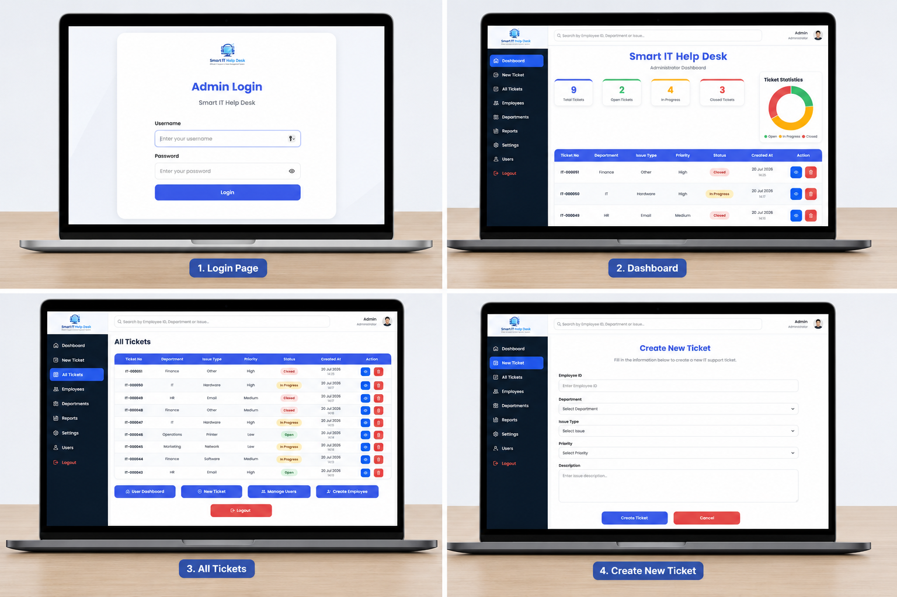

# 💻 Smart IT Help Desk System

A modern web-based IT Help Desk System developed using **PHP**, **MySQL**, **HTML5**, **CSS3**, and **JavaScript** to simplify IT support requests and ticket management.

---

## 📖 Overview

The **Smart IT Help Desk System** is a web application designed to help organizations manage IT support requests efficiently. The system enables administrators to monitor tickets, update their status, and manage employees through a clean and user-friendly dashboard.

---

## 📸 Project Preview

<p align="center">
  
</p>

---

## ✨ Features

### 🔐 Authentication
- Secure Admin Login
- Session Management
- Logout Functionality

### 🎫 Ticket Management
- Create New Tickets
- View Ticket Details
- Update Ticket Status
- Delete Tickets
- Search Tickets
- Priority Management

### 👥 Employee Management
- Add Employees
- Manage Users
- Department Assignment

### 📊 Dashboard
- Total Tickets
- Open Tickets
- In Progress Tickets
- Closed Tickets
- Interactive Ticket Statistics Chart
- Quick Search

---

## 🛠 Technologies Used

- PHP
- MySQL
- HTML5
- CSS3
- JavaScript
- Chart.js
- Bootstrap Icons
- XAMPP

---

## 📂 Project Structure

```text
Smart-IT-Help-Desk/
│
├── css/
├── database/
├── images/
├── add.php
├── admin.php
├── authenticate.php
├── create_admin.php
├── create_employee.php
├── dashboard.php
├── delete.php
├── index.php
├── login.php
├── logout.php
├── update_status.php
├── users.php
├── view_ticket.php
├── database.sql
└── README.md
```

---

## 🚀 Installation

### 1. Clone the repository

```bash
git clone https://github.com/YOUR_USERNAME/Smart-IT-Help-Desk.git
```

### 2. Move the project

Copy the project folder to:

```text
xampp/htdocs/
```

### 3. Create Database

Open **phpMyAdmin**

Create a database named:

```text
helpdesk
```

### 4. Import Database

Import the included file:

```text
database.sql
```

### 5. Configure Database Connection

Edit:

```text
database/database.php
```

Update your database credentials if necessary.

### 6. Run the Project

Open your browser and visit:

```text
http://localhost/Smart-IT-Help-Desk
```

---

## 🎯 System Modules

- Admin Dashboard
- Ticket Management
- Employee Management
- Ticket Search
- Ticket Details
- Status Tracking
- Ticket Statistics
- User Authentication

---

## 📈 Future Improvements

- Email Notifications
- File Attachments
- Dark Mode
- PDF Reports
- Excel Export
- Mobile Responsive Enhancements
- Role-Based Permissions

---

## 🎓 Learning Outcomes

This project demonstrates practical experience in:

- PHP Web Development
- MySQL Database Design
- CRUD Operations
- Authentication & Sessions
- Dashboard Development
- Data Visualization
- Responsive User Interface
- Database Integration

---

## 👨‍💻 Author

**Monerah**

Bachelor of Computer Science

---

## ⭐ If you like this project

Please consider giving it a **Star ⭐** on GitHub.
